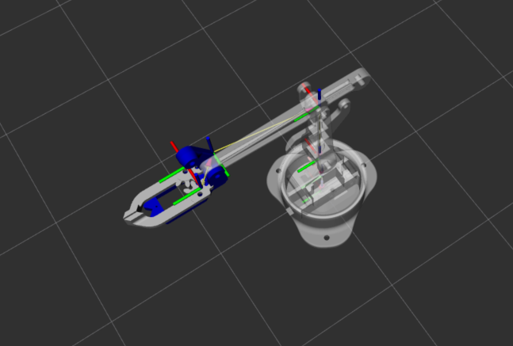
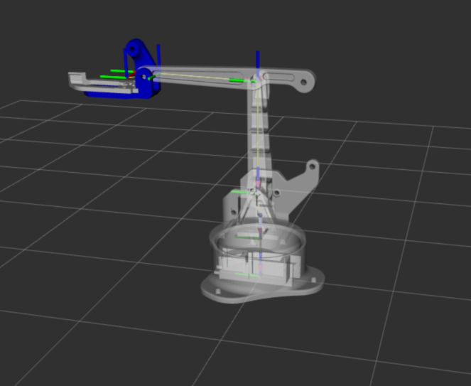
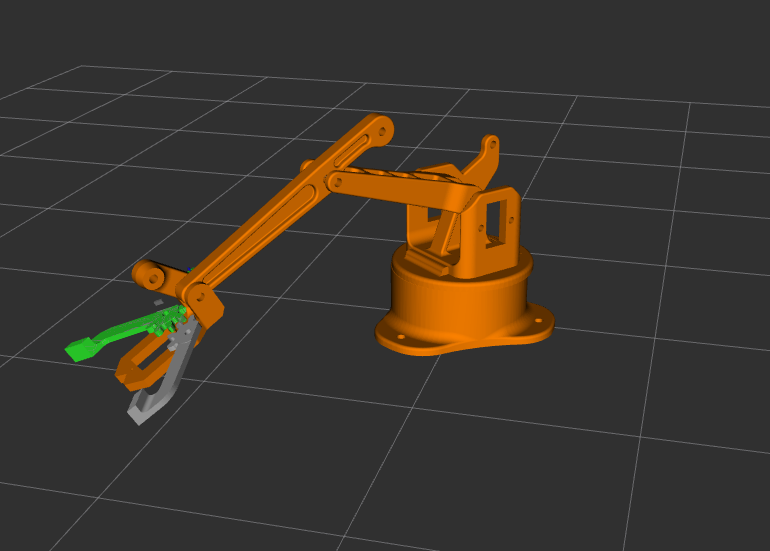
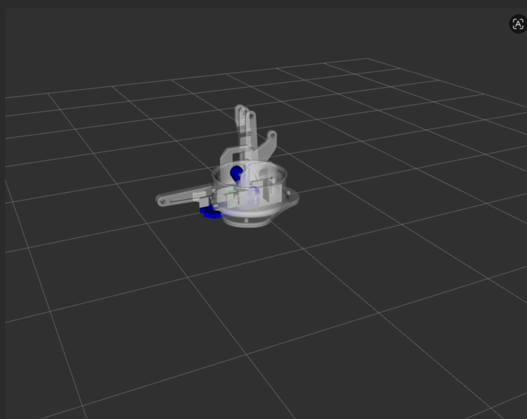
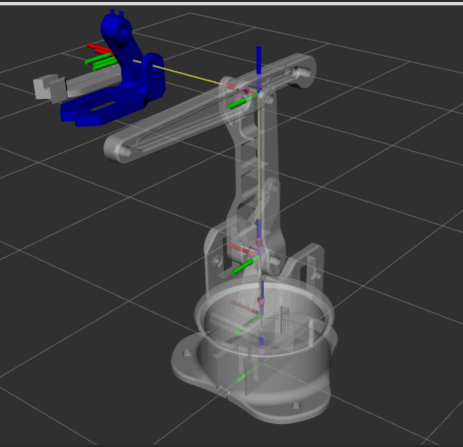

# industrial_arm
# Modélisation d'un bras robotique: URDF / Xacro &amp; MoveIt 2

---
 
## A. Présentation du robot et travail réalisé
 
Ce projet modélise un manipulateur sériel à partir des meshes et du graphe de liaisons fournis, puis le fait passer par toute la chaîne : description cinématique → visualisation RViz → planification et exécution MoveIt 2.
 
Le robot est une chaîne sérielle de trois articulations de bras motorisées, terminée par une pince à deux doigts :
 
| Joint | Type | Parent → Enfant | Fonction |
|-------|------|-----------------|----------|
| `joint1` | revolute (axe Z) | `base_link` → `base_plate` | rotation de la base (lacet) |
| `joint2` | revolute | `base_plate` → `forward_drive_arm` | tangage de l'épaule |
| `joint3` | revolute | `forward_drive_arm` → `horizontal_arm` | tangage du coude |
| `wrist_fixed_joint` | fixed | `horizontal_arm` → `claw_support` | montage rigide du poignet/paume |
| `joint4` | revolute | `claw_support` → `gripper_right` | doigt de la pince (actif) |
| `gripper_left_joint` | revolute (mimic) | `claw_support` → `gripper_left` | doigt miroir (`mimic` de `joint4`, multiplicateur −1) |
 
La pince est modélisée comme une paire **mimic** : seule `joint4` est motorisée, et `gripper_left_joint` la suit avec un multiplicateur de −1, de sorte que les deux doigts s'ouvrent et se ferment symétriquement à partir d'une seule commande.
 
Travail livré :
- Description Xacro complète (liens, visuels, collisions simplifiées, inerties estimées).
- Lancement RViz 2 avec un arbre TF propre (aucun avertissement TF) et actionnement via `joint_state_publisher_gui`.
- Un package de configuration MoveIt 2 généré avec le Setup Assistant (groupe de planification `arm` avec KDL, groupe `gripper`, désignation de l'effecteur terminal, matrice d'auto-collision).
- Une démonstration de planification fonctionnelle : planification OMPL (RRTConnect) + exécution de trajectoire sur matériel simulé (mock hardware).
---

## B. Choix et justification de la représentation

Pour la modélisation de ce bras robotique industriel, une architecture modulaire Xacro (macros XML) a été privilégiée par rapport à un simple fichier URDF brut.

### 1. Critères du choix de Xacro

- Évaluation mathématique: les données de positionnement visuel fournies pour ce bras s'appuient largement sur des expressions mathématiques et des constantes trigonométriques (par exemple, des formules d'orientation telles que rpy="0 -${PI/2} ${PI/2}" pour le bras forward_drive_arm). Un fichier URDF natif ne peut pas évaluer de variables ou d'expressions ; il analyse uniquement des nombres à virgule flottante absolus. L'utilisation de Xacro nous a permis de conserver ces expressions mathématiques exactes directement dans le fichier, ce qui a éliminé les erreurs de précalcul manuel.

- Gestion des propriétés globales: les spécifications du projet stipulent que tous les maillages STL externes sont surdimensionnés et nécessitent un facteur d'ajustement d'échelle global de 0,01 exactement sur les dimensions $X$, $Y$ et $Z$ pour s'afficher correctement. En URDF pur, ce paramètre d'échelle devrait être codé en dur manuellement dans les propriétés visuelles et de collision de chaque lien. Avec Xacro, il est déclaré une seule fois en tant que propriété globale (<xacro:property name="mesh_scale" value="0.01 0.01 0.01" />) et instancié de manière propre dans tout le document, garantissant ainsi la maintenabilité.

### 2. Avantages et Inconvénients  du choix

**`Avantages`**

- Lisibilité et clarté du code : réduit le balisage XML redondant en isolant les valeurs répétitives (telles que les paramètres de liaison, les limites de sécurité et les échelles de conversion) dans des propriétés nommées.

- Modularité: si la conception mécanique change (par exemple, si une liaison physique est allongée ou si une autre échelle de servomoteur est utilisée), les modifications ne doivent être effectuées qu'à un seul endroit dans le code, au lieu de devoir rechercher les occurrences en double dans des centaines de lignes de code XML.

**`Inconvénients`**

- La charge de compilation Xacro désigne le temps de traitement nécessaire à l'analyseur Xacro pour interpréter les macros et les propriétés en une chaîne XML URDF standard. Dans les modèles volumineux comportant des calculs complexes ou des boucles, cela peut entraîner une forte augmentation des temps de lancement. 

### 3. Cas d'un choix différent

On aurait opté pour un fichier URDF simple et unique si le robot avait été une structure minimaliste et rigide, composée uniquement de formes primitives de base (comme un simple boîtier de fixation de capteur fixe ou une configuration cartésienne basique à deux articulations), sans mise à l'échelle complexe des maillages, sans structures articulées symétriques et avec des décalages spatiaux entièrement statiques et précalculés.

--

## C. Hypothèses de modélisation (masses, inerties, limites articulaires)

 
**Géométrie de collision.** La collision par mesh est trop coûteuse et trop détaillée pour la planification, donc la collision de chaque lien est une **primitive** approximant son volume englobant : des cylindres pour la base et la platine cylindriques, des boîtes pour les segments de bras, le support de pince et les doigts. Cela maintient la vérification d'auto-collision rapide.
 
**Masses.** Estimées à partir de la taille relative de chaque pièce (un bras léger, de petite échelle, de type imprimé 3D) :
 
| Lien | Masse (kg) | Primitive de collision |
|------|------------|------------------------|
| `base_link` | 0.5 | cylindre (r 0.10, l 0.03) |
| `base_plate` | 0.3 | cylindre (r 0.06, l 0.04) |
| `forward_drive_arm` | 0.2 | boîte |
| `horizontal_arm` | 0.15 | boîte |
| `claw_support` | 0.1 | boîte |
| `gripper_right` / `gripper_left` | 0.02 chacun | boîte |
 
**Inerties.** Calculées automatiquement par les macros Xacro `inertial_box` / `inertial_cylinder` à partir de la masse estimée et des dimensions de la primitive de chaque lien (formules standard du tenseur pour une boîte pleine et un cylindre plein). Elles sont approximatives mais physiquement plausibles et définies positives.
 
**Limites articulaires.** Choisies pour maintenir le mouvement dans la plage mécanique visible des meshes :
- `joint1` : ±π rad, effort 10 N·m, vitesse 2.5 rad/s.
- `joint2`, `joint3` : ±π/2 rad, effort 12–15 N·m, vitesse 2.0 rad/s.
- `joint4` (pince) : plage **asymétrique** `-0.7 … 0.0` rad. La borne supérieure est fixée à `0.0` (position fermée, au contact) parce qu'au-delà de `0.0` les deux doigts s'interpénètrent ; la borne inférieure `-0.7` correspond à la pince ouverte. Effort 5 N·m, vitesse 1.0 rad/s ; `gripper_left_joint` en hérite via le mimic (multiplicateur −1, le doigt gauche se ferme donc en sens opposé).
- Des **limites d'accélération** ont été ajoutées dans `config/joint_limits.yaml` (`has_acceleration_limits: true`, `max_acceleration: 1.0`) car l'étape de paramétrage temporel de MoveIt les exige (voir Difficultés).

---
 
## D. Structure du dépôt
 
```
industrial_arm/
├── industrial_arm_description/
│   ├── xacro/
│   │   ├── robot_industrial_arm.urdf.xacro  # niveau supérieur : propriétés, matériaux, includes
│   │   ├── robot_core.xacro                 # liens + articulations du bras (joint1–3, poignet)
│   │   ├── gripper.xacro                     # articulations de la pince + doigts (mimic)
│   │   └── inertial_macros.xacro             # macros inertial_box / inertial_cylinder
│   ├── meshes/                               # géométries *.STL (mises à l'échelle 0.01)
│   ├── launch/
│   │   └── display.launch.py                 # RViz 2 + robot_state_publisher + jsp_gui
│   ├── config/
│   │   └── robot_arm.rviz                     # configuration RViz
│   ├── include/  src/                         # créés par ament_cmake (vides pour ce package)
│   └── package.xml / CMakeLists.txt
│
├── industrial_arm_moveit_config/     # généré par le MoveIt Setup Assistant
│   ├── config/                       # SRDF, kinematics.yaml, joint_limits.yaml, contrôleurs
│   ├── launch/                       # demo.launch.py, move_group.launch.py, ...
│   └── package.xml / CMakeLists.txt
│
└── README.md
```

--

## E. Installation de MoveIt jazzy

### 1. Installer ROS 2 Jazzy

Suivre la [documentation officielle ROS 2 Jazzy](https://docs.ros.org/en/jazzy/Installation/Ubuntu-Install-Debs.html).

### 2. Installer les dépendances

```bash
sudo apt install -y \
    ros-jazzy-rviz2 \
    ros-jazzy-xacro \
    ros-jazzy-moveit \
    ros-jazzy-ros2-control \
    ros-jazzy-ros2-controllers \
    ros-jazzy-joint-state-publisher-gui
```
--

### 3. Cloner et compiler le projet

```bash
# Créer le workspace (si pas déjà fait)
mkdir -p ~/ros2_ws/src
cd ~/ros2_ws/src

# Cloner le dépôt
git clone https://github.com/naudecle/industrial_arm.git

# Compiler
cd ~/ros2_ws

# résoudre les dépendances de packages restantes
rosdep install --from-paths src --ignore-src -r -y

 colcon build

# Sourcer l'environnement
source install/setup.bash
```

> 💡 **Astuce** : Ajoutez `source ~/ros2_ws/install/setup.bash` et `source /opt/ros/jazzy/setup.bash` à votre `~/.bashrc` pour ne pas les refaire à chaque terminal.

Avant de redémarrer vos nœuds, vérifiez que le paquet Moveit est correctement reconnu par l'environnement ROS 2:

```bash
ros2 pkg prefix moveit_setup_assistant
```

> 💡 **N.B** : si la commande renvoie le chemin d'accès au paquet, tout est prêt ! Si elle renvoie une erreur `Package not found` , vérifiez que votre compilation `colcon` s'est bien déroulée et que vous avez bien sourcé les chemins d'accès indiqués dans le fichier `setup.bash`.

--

## F. Lancement de RViz 2 et MoveIt 2
 
**Visualiser le modèle dans RViz 2** (avec l'interface de sliders d'articulations) :
 
```bash
ros2 launch industrial_arm_description display.launch.py
```
 
Le bras apparaît avec ses meshes ; `joint_state_publisher_gui` permet de mouvoir chaque articulation, et l'arbre TF est propre (`ros2 run tf2_tools view_frames` confirme un arbre unique et connecté, de `world` jusqu'aux deux doigts).

 
**Lancer la démonstration de planification MoveIt 2 :**
 
```bash
ros2 launch industrial_arm_moveit_config demo.launch.py
```
 
Dans le panneau **MotionPlanning** de RViz :
1. Régler **Planning Group** sur `arm`.
2. Régler **Goal State** sur `<random valid>` (ou utiliser l'onglet **Joints** pour ajuster `joint1`/`joint2`/`joint3`).
3. Cliquer sur **Plan** pour prévisualiser la trajectoire, puis **Plan & Execute** pour l'exécuter.
4. Pour actionner la pince, basculer **Planning Group** sur `gripper`, ouvrir l'onglet **Joints**, déplacer `joint4`, puis **Plan & Execute** — le doigt gauche suit via le mimic.
> Remarque : le bras n'a que 3 DDL, donc les objectifs de pose complets à 6 DDL (déplacer le marqueur interactif vers des points arbitraires) renverront souvent « No IK solution ». C'est attendu ; les objectifs dans l'espace articulaire et `<random valid>` sont les chemins de planification fiables.

--

## G. Captures d'écran et démonstration

**Modèle du robot dans RViz 2**
 

**Géométrie de collision**




**MoveIt Setup Assistant**

         

**Planification et exécution MoveIt**

.gif>)


--


## H. Difficultés rencontrées et solutions apportées

**Échelle des meshes vs unités des origines de joints.** Les meshes sont mises à l'échelle de `0.01`, donc le modèle vit dans un espace de coordonnées réduit où les origines visuelles (par ex. `0.5`) sont grandes. Les translations de joints avaient d'abord été saisies en mètres réels (3,07 cm → `0.0307`), soit dix fois trop petites pour cet espace, ce qui faisait s'effondrer tous les liens sur la base. **Solution :** exprimer les origines de joints dans les mêmes unités réduites (≈ mesure en cm × 0,1), c'est-à-dire multiplier les valeurs métriques par 10.

 

**Orientation des repères vs « posing » visuel.** L'aspect plié du bras provient des rotations `rpy` sur les meshes *visuelles*, alors que les *repères* des liens restent verticaux (Z vers le haut) tout le long de la chaîne. En conséquence, les axes des joints et le décalage du poignet ne correspondaient pas intuitivement à la géométrie visible — la pince se montait dans le mauvais sens, et `joint2`/`joint3` semblaient vriller au lieu de fléchir. **Solution :** réorienter toute la main au niveau du joint de poignet (qui porte rigidement le support et les deux doigts), et choisir des axes de joint perpendiculaires à l'axe long de la mesh posée plutôt que d'utiliser aveuglément l'axe Y du repère.

 

**Plantage de move_group — type de paramètre invalide.** move_group s'arrêtait au démarrage avec `InvalidParameterTypeException : parameter 'joint_limits.joint2.max_velocity' has invalid type: expected [double] got [integer]`. Le Setup Assistant avait écrit une vitesse en nombre entier sans décimale, et les paramètres ROS 2 sont typés strictement. **Solution :** faire de chaque valeur numérique de `joint_limits.yaml` un flottant explicite (`2` → `2.0`).

**Échec de planification — limites d'accélération manquantes.** OMPL trouvait un chemin, mais l'adaptateur `AddTimeOptimalParameterization` échouait : « No acceleration limit was defined for joint joint1 ». **Solution :** activer `has_acceleration_limits: true` et définir une `max_acceleration` pour chaque joint dans `joint_limits.yaml`.
 
**Dépendances manquantes.** `moveit_setup_assistant` puis `controller_manager` étaient « package not found » car MoveIt et ros2_control ne sont pas installés avec ROS de base. **Solution :** les installer via apt (voir Section E).